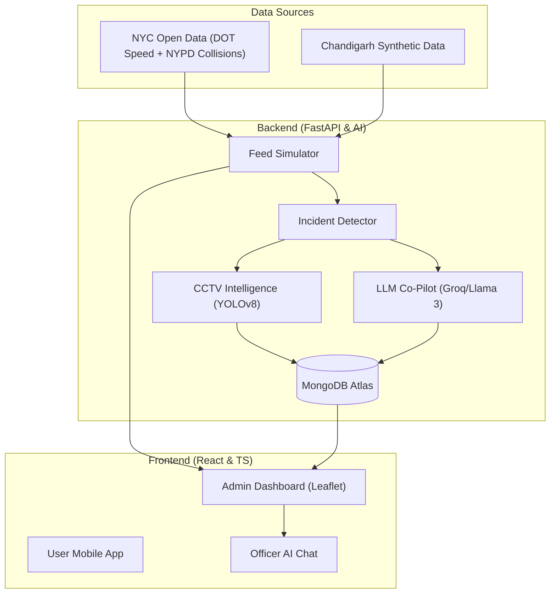

# SENTINEL — Smart Traffic Co-Pilot 🚦🤖

**SENTINEL** is an advanced, AI-driven command center designed for real-time traffic incident management and emergency response. Built for the **Smart Transport PS3** hackathon, it leverages Large Language Models (LLMs) and Computer Vision to provide traffic officers with actionable intelligence, automated signal retiming, and visual incident confirmation.

---

## 🌟 Key Features

### 🧠 LLM-Powered Co-Pilot
*   **Automated Decision Support:** Generates real-time suggestions for signal retiming, diversion routes, and emergency alerts.
*   **Incident Narratives:** Provides structured summaries of traffic conditions, potential causes, and impact assessments.
*   **Officer Chatbot:** A context-aware conversational interface allowing officers to query incident status and CCTV events via natural language.

### 👁️ Visual Intelligence (CCTV + YOLOv8)
*   **Incident Confirmation:** Automatically routes nearest camera feeds to a YOLOv8 pipeline to confirm speed-drop incidents.
*   **Injury & Ambulance Detection:** Detects persons in distress and identifies emergency vehicles to trigger "Green Corridor" routing.
*   **Anomaly Detection:** Flags stationary vehicles on main carriageways and abnormal speed patterns and debris.

### 🗺️ Real-Time Command Dashboard
*   **Interactive Traffic Map:** Live Leaflet-based visualization of road segments colored by speed (using NYC DOT and Chandigarh data).
*   **Collision Integration:** Visualizes recent NYPD crash data to enrich incident context.
*   **Multi-City Support:** Seamlessly toggle between New York City (Real-world data) and Chandigarh (Synthetic digital twin).

### 🚑 Emergency Dispatch
*   **Hospital Alerting:** Automatically identifies the nearest hospital and generates dispatch alerts for confirmed injuries.
*   **Priority Routing:** Provides A*-based diversion routes and fastest-path guidance for first responders.

---

## 🏗️ Architecture



---

## 🛠️ Tech Stack

*   **Frontend:** [React 18](https://reactjs.org/), [TypeScript](https://www.typescriptlang.org/), [Vite](https://vitejs.dev/), [Leaflet.js](https://leafletjs.com/), [Tailwind CSS](https://tailwindcss.com/), [Zustand](https://docs.pmnd.rs/zustand).
*   **Backend:** [Python 3.10+](https://www.python.org/), [FastAPI](https://fastapi.tiangolo.com/), [Motor](https://motor.readthedocs.io/) (Async MongoDB), [pandas](https://pandas.pydata.org/).
*   **AI/ML:** [YOLOv8](https://ultralytics.com/yolov8) (Ultralytics), [Groq API](https://groq.com/) (Llama-3.3-70b), [OpenRouteService](https://openrouteservice.org/).
*   **Database:** MongoDB Atlas (Persistent storage for incidents, chat history, and CVD events).

---

## 🚀 Getting Started

### Prerequisites
- Python 3.10 or higher
- Node.js 18 or higher
- MongoDB Atlas cluster (recommended) or local MongoDB instance

### Environment Setup

1.  **Clone the repository:**
    ```bash
    git clone <repository-url>
    cd merge-conflict
    ```

2.  **Configure Environment Variables:**
    Create a `.env` file in the `backend/` directory based on the following template:
    ```env
    # API Keys
    GROQ_API_KEY=your_groq_key
    ORS_API_KEY=your_openrouteservice_key
    NYC_APP_TOKEN=your_nyc_open_data_token

    # Database
    MONGODB_URI=your_mongodb_atlas_uri

    # App Settings
    ACTIVE_CITY=nyc
    ```

### Running the System

For ease of use, you can use the provided batch files to start all services simultaneously:

-   **Start All:** Run `start.bat` from the root directory.
    -   Starts the Backend on `http://localhost:8000`
    -   Starts the Admin Dashboard on `http://localhost:5173`
    -   Starts the User App on `http://localhost:5174`

-   **Stop All:** Run `stop.bat` to kill all active processes.

---

## 📂 Project Structure

```text
.
├── backend/               # FastAPI Server, AI Pipeline, and Data Services
│   ├── data/              # Traffic datasets (NYC/CHD)
│   ├── models/            # YOLOv8 weights and processing logic
│   ├── routers/           # API endpoints (incidents, chat, collisions)
│   ├── services/          # Core logic (LLM, Routing, Feed Sim)
│   └── app.py             # Main entry point
├── frontend/              # Admin Command Center (React + Leaflet)
├── user-app/              # Public-facing traffic alert app
├── run.bat / start.bat    # Automation scripts
└── SENTINEL_Report.md     # Detailed technical documentation
```

---

## 🔌 API Reference (Highlights)

| Endpoint | Method | Description |
| :--- | :--- | :--- |
| `/api/incidents` | `GET` | List all active traffic incidents. |
| `/api/feed/current` | `GET` | Fetch real-time road segment speeds. |
| `/api/chat` | `POST` | Interactive AI Chat with full incident context. |
| `/api/demo/inject` | `POST` | Simulation tool to inject incidents for demo. |
| `/ws/nyc` | `WS` | Real-time WebSocket stream for traffic updates. |

---

## 👥 Team SENTINEL

This project was developed by:
- **Pranshul Soni** (Backend Architect & API Lead)
- **Mitansh** (Frontend Developer & UI Lead)
- **Team Member 3** (CCTV & AI Pipeline)
- **Team Member 4** (Chatbot & Data Preparation)

---

*This project was built for the Smart Transport PS3 Hackathon challenge.*
